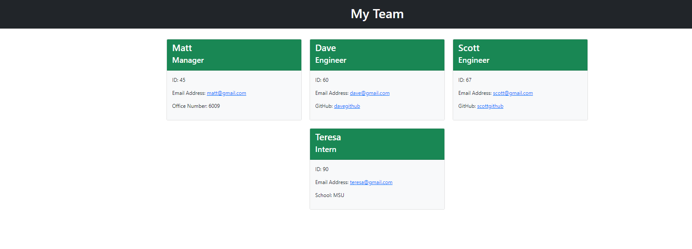

# Team Profile Generator

## Description

A node.js application that generates a team profile based on user prompts.  Application also uses jest and inquirer for testing and prompts respectively.

## Installation

### Node
In the integrated terminal: npm install

### Jest
In the integrated terminal: npm install jest --save-dev
You must change the "test" value to "jest" in the package.json file in order to run your tests.
Please refer to: https://jestjs.io/docs/getting-started 

### Inquirer
In the integrated terminal: npm install inquirer
Please refer to: https://www.npmjs.com/package/inquirer#installation

## Screenshot

## Walkthrough Video
https://drive.google.com/file/d/1sk_q-7EXNeED7ltH_Yiibyz-TdhVAWSo/view 